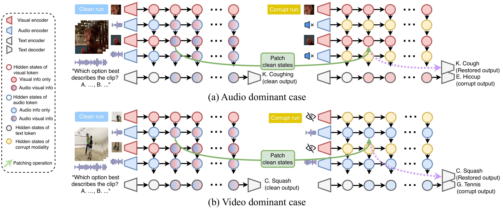

<div align="center">

# Probing Cross-modal Information Hubs in Audio-Visual LLMs

[](https://arxiv.org/abs/2605.10815)

*Official implementation of* **"Probing Cross-modal Information Hubs in Audio-Visual LLMs"** *(ICML 2026)*

</div>

---

## ✨ Overview

We explore the **internal mechanisms of cross-modal interaction** in Audio-Visual Large Language Models (AVLLMs), investigating *where* information derived from one modality (audio or visual) is stored within the token representations of the other modality. We adapt the well-established **causal tracing** technique through our proposed **Unimodal Dominance based framework**, and build on these findings to design a simple, **training-free** hallucination mitigation method — **ASD** — that encourages reliance on integrated cross-modal information within *cross-modal sink tokens*.

<p align="center">
  
</p>
---

## 🛠️ 1. Environment

```bash
mamba env create -f qwen.yml
mamba activate qwen
```

---

## 📦 2. Dataset

We use [**VGGSound**](https://www.robots.ox.ac.uk/~vgg/data/vggsound/) for main experiments.

---

## 🧪 3. Causal Tracing

To run causal tracing in a **memory-efficient** way, we split the procedure into **two stages**.

### Stage 1 — Compute pre-patching probabilities & pre-compute sinks

In this stage, we obtain the model's output probabilities *before* patching, and pre-compute the cross-modal / unimodal sink tokens.

#### 🎵 Audio-dominant case

```bash
python infer_with_prob.py \
    --json_path json_files/causal_tracing/step1/people_case_2_small.json \
    --save_path exp/causal_tracing/step1/people \
    --modality av --k_divide 2

python infer_with_prob.py \
    --json_path json_files/causal_tracing/step1/people_case_2_small.json \
    --save_path exp/causal_tracing/step1/people \
    --modality v --k_divide 2
```

#### 🎬 Video-dominant case

```bash
python infer_with_prob.py \
    --json_path json_files/causal_tracing/step1/sports_case_1_small.json \
    --save_path exp/causal_tracing/step1/sports \
    --modality av --k_divide 2

python infer_with_prob.py \
    --json_path json_files/causal_tracing/step1/sports_case_1_small.json \
    --save_path exp/causal_tracing/step1/sports \
    --modality a --k_divide 2
```

`json_files/step1/people_case_2.json` and `json_files/step1/sports_case_1.json` contain only the samples filtered by the **Unimodal Dominance Framework**.

#### Filter samples for Stage 2

```bash
python preprocess/step1/output2input_people.py \
    --input_file exp/causal_tracing/step1/people/av/people_case_2_small.json \
    --output_path json_files/causal_tracing/step2/people_small.json

python preprocess/step1/output2input_sports.py \
    --input_file exp/causal_tracing/step1/sports/av/sports_case_1_small.json \
    --output_path json_files/causal_tracing/step2/sports_small.json
```

---

### Stage 2 — Patch the selected token set

In this stage, we patch a chosen subset of tokens — one of **All / Object / Sink / Random / Cross-modal sink / Unimodal sink** — and measure the resulting causal effect.

#### 🎵 Audio-dominant case

```bash
python causal_tracing_modality_sink_image.py \
    --json_path json_files/causal_tracing/step2/people_small.json \
    --save_path exp/causal_tracing/step2/people \
    --mode people \
    --replace_mode cross_modal_sink \
    --k_divide 2 \
    --sink_folder exp/causal_tracing/step1/people/av/history
```

#### 🎬 Video-dominant case

```bash
python causal_tracing_modality_sink.py \
    --json_path json_files/causal_tracing/step2/sports_small.json \
    --save_path exp/causal_tracing/step2/sports \
    --mode sports \
    --replace_mode cross_modal_sink \
    --k_divide 2 \
    --sink_folder exp/causal_tracing/step1/sports/av/history
```

**Arguments**

- `--replace_mode` — choose from `all`, `sink`, `object`, `random_sink_num`, `uni_modal_sink`, `cross_modal_sink`.
  > ⚠️ For `object` mode, preprocessing with [OpenFLAM](https://github.com/adobe-research/openflam) and [SAM2](https://github.com/facebookresearch/sam2) is required beforehand.
- `--k_divide` — required for sink-based modes; choose from `2`, `3`, or `4`.

---

## 📝 Citation
```bibtex
@inproceedings{
jung2026probing,
title={Probing Cross-modal Information Hubs in Audio-Visual {LLM}s},
author={Jihoo Jung and Chaeyoung Jung and Ji-Hoon Kim and Joon Son Chung},
booktitle={Forty-third International Conference on Machine Learning},
year={2026},

}

```
